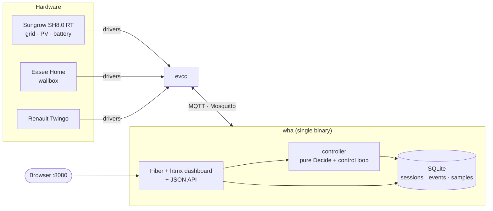
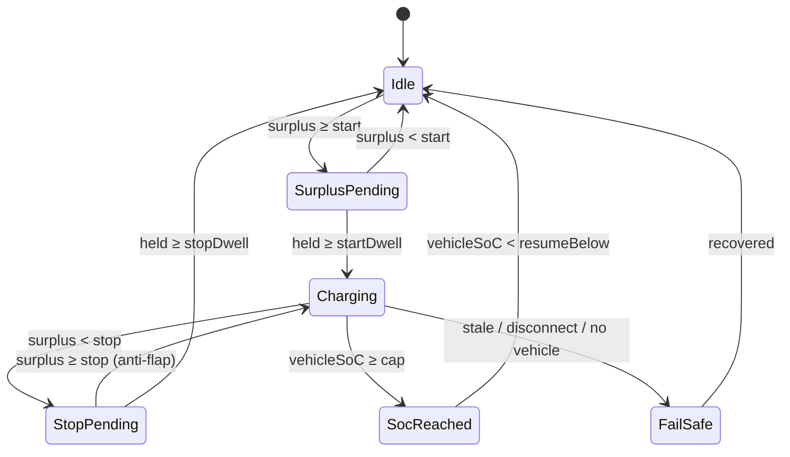

# wha — Wallbox Home Automation

A small Go service that runs PV-surplus EV charging on top of [evcc](https://evcc.io).
It reads live state from evcc over MQTT, applies its own decision policy, and toggles
the loadpoint — with a web dashboard and history.

**Two rules:**
- **Surplus detected → start charging** (sustained PV surplus over a threshold).
- **Vehicle SoC > 80% → stop charging** (hard cap, latched).

## Hardware

| Role                       | Device                  | evcc template    |
| -------------------------- | ----------------------- | ---------------- |
| Inverter (grid+PV+battery) | Sungrow SH8.0 RT hybrid | `sungrow-hybrid` |
| Wallbox                    | Easee Home              | `easee`          |
| Vehicle                    | Renault Twingo Electric | `renault`        |

## Architecture



evcc owns all hardware. wha owns the *decision*: when surplus is sustained it sets the
loadpoint to `pv` (evcc then modulates current to the actual surplus, avoiding grid
import); on SoC cap, fail-safe, or manual override it sets `off`. It also keeps evcc's
`limitSoc` set to the cap as a dead-man backstop (re-asserted on reconnect / evcc
restart), so the 80% stop is enforced even if wha dies.

### Decision policy (the core)

Each control tick the loop reads an evcc snapshot, maps it to `Inputs`, and runs a **pure**
`Decide` function (`internal/controller/policy.go`, clock-injected, fully unit-tested):

```
surplus = chargePower − gridPower − max(0, batteryPower)
```

with hysteresis (separate start/stop thresholds) and dwell timers (sustained for minutes,
to protect the Easee contactor from cloud-latency churn). Priority order — **fail-safe
wins over everything**:



Override (`Auto` / `ForceOn` / `ForceOff`, from the dashboard) and the connection gate sit
above the surplus logic; `Stale → off` sits above everything.

## Layout

```
cmd/wha             entrypoint (loads config, runs app)
internal/config     config model + validation + viper loader (WHA_* env > file > default)
internal/store      SQLite (pure-Go modernc) + golang-migrate embedded migrations
internal/controller pure Decide/Surplus + the stateful control loop
internal/evcc       paho MQTT client + thread-safe state store
internal/web        Fiber + htmx + Tailwind dashboard and JSON API
internal/app        composition root (errgroup, graceful shutdown)
```

See [docs/mqtt.md](docs/mqtt.md) for the exact evcc MQTT topic contract and
[CONTRIBUTING.md](CONTRIBUTING.md) for build/test conventions.

## Run

### Quick install (Raspberry Pi)

One command sets up the whole stack — checks Docker, lets you pick the `wha`
version, prompts for your Sungrow/Easee/Renault credentials, generates a
secured Mosquitto broker (auth + ACL), and starts everything:

```sh
curl -fsSL https://raw.githubusercontent.com/Joessst-Dev/wallbox-homeautomation-go/main/scripts/install.sh | bash
```

It installs into `~/wha` (override with `WHA_DIR`). To preview the generated
config without starting anything, pass `--dry-run`; to skip the version prompt,
set `WHA_IMAGE_TAG=latest`. From a cloned repo you can also run `make install`.
The manual path below is the equivalent done by hand.

For the full walkthrough — what the script does step by step, all env overrides,
generated files, re-run behaviour, version model, and troubleshooting — see
**[docs/install.md](docs/install.md)**.

- wha dashboard: `http://<pi>:8080`
- evcc UI: `http://<pi>:7070`

### Docker Compose (manual)

`docker-compose.yml` pulls the published multi-arch image
(`ghcr.io/joessst-dev/wha:edge`, public on GHCR) — no local build needed:

```sh
cp evcc.example.yaml evcc.yaml      # fill in Sungrow IP, Easee + Renault creds
# (optional) tune thresholds in config.yaml
docker compose up -d                # or: make compose-up
```

Check it came up cleanly:

```sh
docker compose logs -f wha          # expect "store opened" + "web server listening"
curl -s localhost:8080/healthz      # -> ok
```

Switch the `wha` image tag to `:latest` or a `:x.y.z` once you cut a release.

**Updating.** A plain `docker compose up -d` will *not* pull a newer `:edge`
(Compose skips the pull when a tag is already cached). To update, pull first:

```sh
docker compose pull wha && docker compose up -d
```

#### Run a local source build instead

To build `wha` from source instead of pulling the image, layer the local override
(it tags the build `:local` so it never clobbers the pulled `:edge`):

```sh
docker compose -f docker-compose.yml -f docker-compose.local.yml up -d --build
# or: make compose-local
```

It's a named file (not `docker-compose.override.yml`) on purpose, so a plain
`docker compose up` on the Pi keeps using the published image.

### Local development

```sh
make test           # all Ginkgo suites
make run            # against a broker on localhost:1883 (WHA_* env)
make css            # recompile Tailwind after editing templates
make build-arm64    # static, cgo-free binary for the Pi
./bin/wha --version # build metadata (injected by GoReleaser on release)
```

## Configuration

`wha` is a single binary with **no subcommands and no flags**: on startup it applies
database migrations, then runs the control loop and web server until signaled
(SIGINT/SIGTERM).

Configuration is loaded by viper from (highest precedence first): `WHA_*` environment
variables, a YAML config file, then built-in defaults. The file path comes from
`WHA_CONFIG`, or `config.yaml` is searched for in `/etc/wha` and the working directory.
Env keys are `WHA_<SECTION>_<KEY>`, with nested camelCase keys uppercased fully — e.g.
`control.startThresholdW` → `WHA_CONTROL_STARTTHRESHOLDW`, `mqtt.broker` → `WHA_MQTT_BROKER`.
Durations accept Go syntax (`60s`, `2m`, `6h`).

### Full reference

| Key                         | Default              | Meaning |
| --------------------------- | -------------------- | ------- |
| `mqtt.broker`               | `tcp://localhost:1883` | Mosquitto broker URL |
| `mqtt.clientID`             | `wha`                | MQTT client id (must be unique on the broker) |
| `mqtt.username` / `password`| empty                | Broker credentials (set these — see Security) |
| `mqtt.topicPrefix`          | `evcc`               | evcc's MQTT topic prefix |
| `evcc.loadpointID`          | `1`                  | Which evcc loadpoint to control (1-based) |
| `control.enableMode`        | `pv`                 | Mode published when charging is enabled (`pv` or `now`) |
| `control.startThresholdW`   | `1400`               | Surplus (W) required to start charging |
| `control.stopThresholdW`    | `0`                  | Surplus (W) below which charging stops |
| `control.startDwell`        | `2m`                 | Surplus must hold this long before starting (anti-flap) |
| `control.stopDwell`         | `3m`                 | Low surplus must hold this long before stopping |
| `control.socCap`            | `80`                 | Stop charging at this vehicle SoC (%) |
| `control.socResumeBelow`    | `78`                 | Only resume once SoC drops below this (latch) |
| `control.decisionInterval`  | `15s`                | How often the control loop evaluates |
| `control.staleTimeout`      | `60s`                | Fast power metrics older than this → fail-safe (off) |
| `control.republish`         | `5m`                 | Re-send mode + limitSoc backstop (set-topics aren't retained) |
| `control.retentionWindow`   | `2160h` (90d)        | Prune samples/events older than this; `0` disables pruning |
| `control.retentionInterval` | `6h`                 | How often the pruning janitor runs |
| `web.bindAddr` / `web.port` | `0.0.0.0` / `8080`   | Dashboard + API bind address/port |
| `db.path`                   | `/data/wha.db`       | SQLite database path |
| `log.level`                 | `info`               | `debug` \| `info` \| `warn` \| `error` |

## Safety model

- **Fail-safe to off.** Stale power data, a broker disconnect, evcc going offline (LWT),
  or no vehicle connected all force the loadpoint to `off`. This beats every other rule.
- **SoC cap is latched.** Once vehicle SoC reaches `socCap` charging stops and only
  resumes below `socResumeBelow`, preventing flapping at the boundary.
- **Dead-man backstop.** wha keeps evcc's loadpoint `limitSoc` set to `socCap` and
  re-asserts it on broker reconnect and on the evcc-online edge, so evcc enforces the
  stop even if wha crashes or the broker blips.
- **Vehicle SoC is never stale-gated.** evcc polls the Renault cloud ~hourly and only
  while charging, so the last known SoC is always used (the backstop bounds any overshoot).

## ⚠️ Security

evcc does **not** authenticate MQTT set-topics — anyone who can publish to the broker can
control your charging. The one-command installer (`scripts/install.sh`) secures Mosquitto
automatically: it generates a random credential, hashes it with `mosquitto_passwd`, and
writes an ACL that restricts the `wha` user to `evcc/#`. If you configure the stack by
hand, add credentials + ACLs to `mosquitto/config/mosquitto.conf` before exposing
anything, and keep the broker on your home network. See
[docs/install.md — Security](docs/install.md#security) for details on the credential
model and a possible finer two-user hardening split.

## Troubleshooting

- **`open store: ... unable to open database file (14)` (SQLITE_CANTOPEN).** The container
  runs as nonroot; a pre-existing root-owned `wha-data` volume blocks DB creation. Recreate
  it: `docker compose down -v && docker compose up -d` (or remove just the
  `*_wha-data` volume).
- **No data on the dashboard / `readyz` is 503.** wha can't reach the broker or evcc isn't
  publishing. Confirm evcc has an `mqtt:` block pointing at Mosquitto, and inspect topics
  with MQTT Explorer. Topic names/casing must match — see [docs/mqtt.md](docs/mqtt.md).
- **Sungrow values missing/zero.** The WiNet-S dongle needs recent firmware and Modbus TCP
  enabled (port 502); older firmware doesn't expose power/SoC.
- **Charging won't start on a fresh setup.** evcc only polls vehicle SoC while charging, so
  SoC may be unknown at first. Use the dashboard's "Charge now" (ForceOn) once to kick-start;
  auto mode then works.
- **80% overshoot.** Coarse Renault SoC means the cap can overshoot by up to a poll
  interval; the evcc `limitSoc` backstop bounds it.
- **Brief grid draw in `pv` mode.** There's an unavoidable minimum charge power
  (~1.4 kW single-phase), so a little grid import can occur as surplus dips before evcc pauses.
- **Installer issues.** See [docs/install.md — Troubleshooting](docs/install.md#troubleshooting)
  for installer-specific problems (missing terminal, Docker daemon, checkconfig errors).

## CI/CD

GitHub Actions: CI (lint/test/cross-compile) on PRs and `main`; a multi-arch image
(`ghcr.io/joessst-dev/wha`) on pushes to `main` (`:edge`, `:sha`); and GoReleaser on `v*`
tags (binaries + `:latest`/semver images). See [CONTRIBUTING.md](CONTRIBUTING.md).
